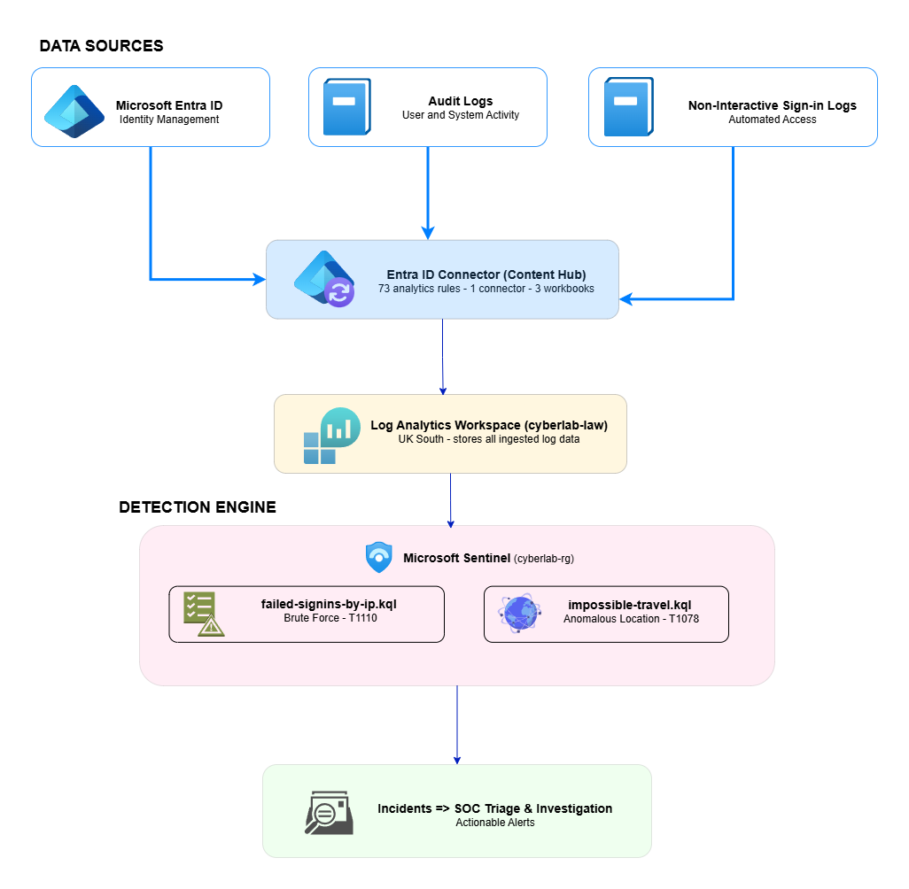

# Microsoft Sentinel SIEM Deployment & SOC Alert Triage

A hands-on cloud security lab deploying Microsoft Sentinel as a SIEM in Azure, connecting real identity log sources, writing KQL detection rules, and performing SOC-style alert triage on live data.

---

## Architecture

---

## Tech stack

| Tool | Purpose |
|---|---|
| Microsoft Sentinel | SIEM & SOAR platform |
| Microsoft Entra ID | Identity log source |
| Log Analytics Workspace | Log storage and querying |
| KQL | Detection rule authoring and investigation |
| Azure Portal | Infrastructure provisioning |

---

## What was built

### Phase 1 — Infrastructure setup

- Resource group `cyberlab-rg` provisioned in UK South
- Log Analytics Workspace `cyberlab-law` deployed
- Microsoft Sentinel enabled on free trial (10 GB/day, expires July 14, 2026)

### Phase 2 — Detection engineering

- Microsoft Entra ID solution installed from Content Hub (73 analytics rules, 1 connector, 3 workbooks)
- Audit Logs and Non-Interactive Sign-in Logs connected
- Two KQL detection queries written and saved:
  - `failed-signins-by-ip.kql` — detects brute force by grouping failed sign-ins by IP
  - `impossible-travel.kql` — detects logins from different locations within 60 minutes
- Two analytics rules enabled:
  - Brute force attack against Azure Portal (Medium, T1110)
  - Anomalous sign-in location by user account (Medium, T1078)

### Phase 3 — SOC triage

- Real log data confirmed flowing: 301 sign-in events from `154.161.xxx.xxx` (GH)
- Brute force rule fired and incident investigated end-to-end
- Incident classified as Benign Positive — activity traced to analyst lab session
- Full triage runbook and incident report produced

---

## Repository structure

azure-sentinel-soc-lab/
├── README.md
├── architecture/
│   └── architecture-diagram.png
├── docs/
│   ├── project-brief.md
│   ├── soc-triage-runbook.md
│   └── incident-report.md
├── images/
│   ├── 01-cyberlab-rg-created.png
│   ├── 02-cyberlab-law-deployed.png
│   ├── 03-sentinel-activated.png
│   ├── 04-entra-id-connector-connected.png
│   ├── 05-logs-flowing.png
│   ├── 06-kql-query1-results.png
│   ├── 07-kql-query2-results.png
│   └── 08-analytics-rules-enabled.png
└── queries/
├── failed-signins-by-ip.kql
└── impossible-travel.kql

---

## Constraints and notes

- Entra ID free tier does not include P1/P2 — full sign-in log fields unavailable
- `SigninLogs` data aged out within 7 days; original results captured in `images/`
- `AuditLogs` connector configured but slow to ingest on free tier
- Source IP redacted as `154.161.xxx.xxx` in all screenshots for public repo
- Sentinel free trial expires July 14, 2026

---

## Documents

- [Project Brief](docs/project-brief.md)
- [SOC Triage Runbook](docs/soc-triage-runbook.md)
- [Incident Report IR-2026-001](docs/incident-report.md)

---

*NexaCore Technologies is a fictional company name used for portfolio presentation purposes.*